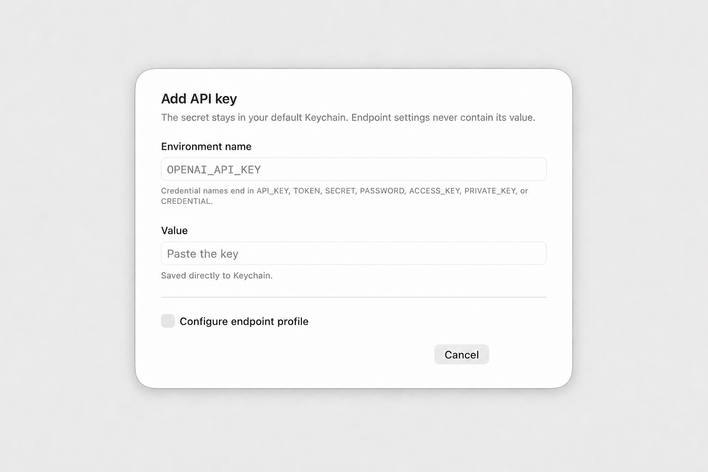

# EnvLatch

Store API keys once in macOS Keychain. Launch any local agent, SDK, script, test,
or backend with exactly the EnvLatch-managed saved keys it needs.



```sh
envlatch run --using "Backend" -- npm test
envlatch run --using "AI tools" -- claude
envlatch run --using "Release" -- ./scripts/deploy.sh
```

The launched process receives ordinary environment variables, so existing code
keeps working as if the values came from a `.env` file. No EnvLatch SDK,
provider-specific command, proxy, or code change is required.

## Why EnvLatch

- **One command for every provider and tool.** Profiles select environment
  variables; they do not select a hard-coded provider integration.
- **Multiple keys without broad exposure.** A launch profile can contain one or
  many saved keys, while unselected EnvLatch keys are not read from Keychain.
- **Endpoint-compatible.** Per-key metadata can map a saved credential to the
  variable and base URL expected by Anthropic-, OpenAI-, or generic clients.
- **Agent-friendly without revealing values.** The bundled portable skill
  teaches any agent or host to inspect non-secret profile names and wrap its
  normal command.
- **Native and local.** Values stay in the non-synchronizing macOS default
  Keychain. There is no server, account, sync layer, or custom cryptography.

## Install from source

Requirements: macOS 13 or newer and Xcode 16 or a Swift 6 toolchain.

```sh
git clone https://github.com/Raylinkh/envlatch.git
cd envlatch
./scripts/install.sh
open "$HOME/Applications/EnvLatch.app"
```

The installer:

- builds `EnvLatch.app` and installs it in `~/Applications`;
- creates `~/.local/bin/envlatch` as a symlink to the executable inside the app;
- installs one canonical skill at `~/.agents/skills/envlatch`;
- adds discovery links for Codex, Claude Code, and Gemini CLI.

Those agent links are conveniences, not an allowlist. Existing EnvLatch or
legacy AgentKeyring install paths are moved to timestamped backups.

Source builds are ad-hoc signed by default. That is suitable for local source
installation, but a rebuild may cause macOS to request Keychain authorization
again. See [Binary releases](#binary-releases) for the trusted distribution
boundary.

## Quick start

1. Open EnvLatch and choose **Add Key**.
2. Save a credential-shaped environment name such as `OPENAI_API_KEY`,
   `ANTHROPIC_API_KEY`, `GITHUB_TOKEN`, or `AWS_SECRET_ACCESS_KEY`.
3. If a client uses a compatible API at a custom endpoint, enable **Endpoint
   profile** and set its contract, base URL, and target credential variable.
4. Choose **New Profile** and select the exact saved keys a command needs.
5. Launch the normal command through that profile:

```sh
envlatch run --using "Backend" -- python3 server.py
```

For example, a profile can select both `OPENAI_API_KEY` and `GITHUB_TOKEN`.
Python, Node, Swift, shell commands, and their SDKs read those variables
normally:

```python
import os

openai_key = os.environ["OPENAI_API_KEY"]
github_token = os.environ["GITHUB_TOKEN"]
```

EnvLatch replaces itself with the target executable using `execve`; it does not
invoke a shell or interpolate the arguments.

## Endpoint metadata

Endpoint metadata belongs to one saved key and never contains its value. It can
record:

- a display label;
- API contract (`Anthropic`, `OpenAI Chat Completions`, `OpenAI Responses`, or
  `Gemini`);
- HTTPS base URL with no query or fragment, with plain HTTP allowed only for
  loopback development;
- the credential variable expected by the target client.

A saved key can therefore remain `MINIMAX_API_KEY` while an Anthropic-compatible
client receives the same value as `ANTHROPIC_AUTH_TOKEN` plus the configured
`ANTHROPIC_BASE_URL`. A launch profile independently decides whether that key
is available to a command.

EnvLatch validates the entire profile before reading any selected value. It
rejects missing keys, two sources targeting the same credential variable, and
conflicting contract configuration rather than choosing a last writer.

## Agent and host setup

Pairing is optional, one-time setup status—not authorization. Any agent or host
can provide its own display name:

```sh
envlatch pair "My build agent"
envlatch doctor
envlatch help
envlatch profiles
```

The GUI includes a copyable setup prompt with those commands and the
least-privilege launch rule. The installed skill instructs agents to ask for a
profile when none matches; it must not silently fall back to broad access.

Safe inspection commands never read secret values:

```sh
envlatch list
envlatch profiles
envlatch doctor
envlatch version
envlatch help
```

`envlatch run -- <command>` remains an explicit compatibility mode that exposes
every saved key to the launched process. Prefer `run --using`.

## Security boundary

EnvLatch reduces accidental credential leakage into repositories, `.env`
files, shell profiles, terminal history, command arguments, and its own logs.
It deliberately has no reveal, clipboard, export, `eval`, or `.env` command.

Environment injection is not secret isolation. A launched process and its
descendants can read every variable selected for that launch, and crash or
debug tooling may expose process memory. EnvLatch does not sandbox a malicious
agent or dependency. Use scoped keys and provider-side spending limits.

EnvLatch preserves the caller's inherited environment. It prevents unselected
EnvLatch Keychain items from being read, but it does not scrub credentials that
were already exported by the parent shell or launcher. Start from a clean
environment when inherited variables are also in scope.

Credential names must be uppercase POSIX variable names with a recognized
credential suffix. Loader-control names beginning with `DYLD_` or `LD_` are
rejected. Executables and symlinks are fully resolved and validated before
Keychain values are read.

The rename to EnvLatch intentionally retains the internal Keychain service
`dev.agentkeyring.secrets` and Application Support directory `AgentKeyring`.
This is a compatibility decision: existing values remain in one store and are
not copied during migration. See [SECURITY.md](SECURITY.md) for the full
boundary and reporting process.

## Development

```sh
swift test
./scripts/build-app.sh
dist/EnvLatch.app/Contents/MacOS/EnvLatch --version
```

The accepted behavior and release proof contract is in [SPEC.md](SPEC.md).
Current evidence and its limits are recorded in
[VERIFICATION.md](VERIFICATION.md).

GitHub Actions runs the test suite, validates scripts and bundle metadata,
builds the app, and verifies its structural code signature.

## Binary releases

No downloadable binary is claimed until it has been Developer ID signed,
notarized by Apple, stapled, and assessed by Gatekeeper. A maintainer with those
credentials can prepare one with:

```sh
ENVLATCH_CODESIGN_IDENTITY="Developer ID Application: Name (TEAMID)" \
ENVLATCH_NOTARY_PROFILE="envlatch-notary" \
./scripts/package-release.sh
```

The script emits a notarized zip and SHA-256 checksum under `dist/`. Source
installation remains the v0.1 distribution path until that receipt exists.

## License

[MIT](LICENSE)
