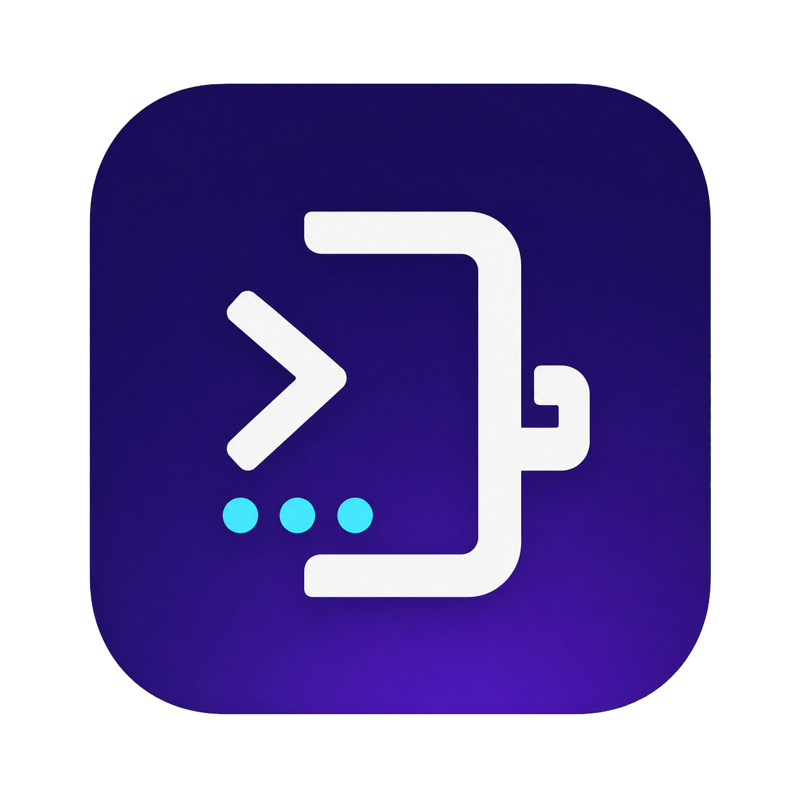
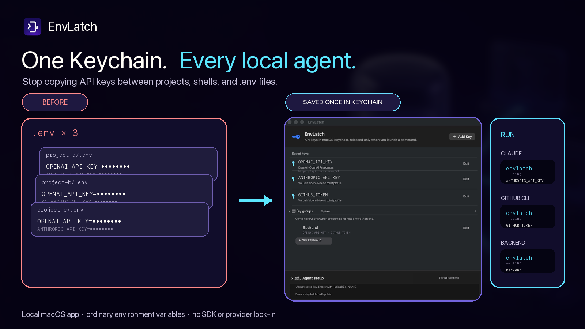
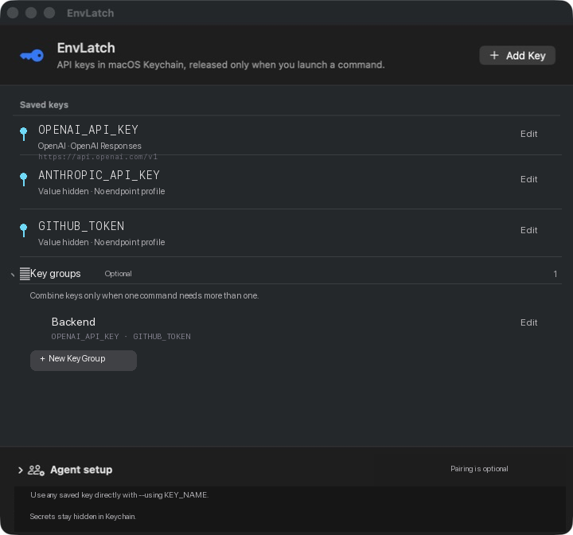

<p align="center">
  
</p>

<h1 align="center">EnvLatch — 所有本地 Agent 共用一个 macOS 钥匙串</h1>

<p align="center">
  API Key 只保存一次。启动任何本地 Agent、SDK、脚本、测试或后端时，只注入它真正需要的 Key。
</p>

<p align="center">
  <a href="README.md">English</a> ·
  <a href="README.zh-CN.md"><strong>简体中文</strong></a>
</p>

<p align="center">
  <a href="https://github.com/Raylinkh/envlatch/releases"></a>
  <a href="https://github.com/Raylinkh/envlatch/actions/workflows/ci.yml"></a>
  
  
  <a href="LICENSE"></a>
  <a href="https://github.com/Raylinkh/envlatch/releases"></a>
</p>



```sh
envlatch run --using ANTHROPIC_API_KEY -- claude
envlatch run --using GITHUB_TOKEN -- gh auth status
envlatch run --using OPENAI_API_KEY --using GITHUB_TOKEN -- npm test
envlatch run --using "Backend" -- npm test
```

EnvLatch 启动后的程序收到的是普通环境变量，所以现有代码仍然像读取 `.env` 一样工作。不需要
EnvLatch SDK、不需要 Provider 专用命令、不需要代理，也不需要修改业务代码。

原生 App 会跟随 macOS 语言显示英文或简体中文。命令、环境变量名称、Provider 名称和复制给
Agent 的设置提示词在不同语言下保持不变。

## 为什么用 EnvLatch

- **所有 Provider 和工具共用一条命令。** 直接选择已保存的 Key，或选择可选的 Key
  Group；EnvLatch 不把你锁进某个 Provider。
- **需要多个 Key，也不用全量暴露。** 临时使用时重复 `--using`；经常复用时，把同一组
  Key 名称保存成 Key Group。未选择的 EnvLatch Key 不会从钥匙串读取。
- **兼容自定义 Endpoint。** 每个 Key 都可以映射到 Anthropic、OpenAI 或 Gemini 客户端
  期望的环境变量和 Base URL。
- **Agent 能使用，但看不到值。** 安装时附带的 Skill 会教任何 Agent 或 Host 查看非敏感
  Key 名称，并包装它原本要运行的命令。
- **原生、本地。** 值保存在 macOS 默认钥匙串的非同步项目中；没有服务器、账号、同步层或
  自制加密算法。
- **人看的界面支持双语。** 原生 GUI、对话框、输入校验、修复说明和辅助功能标签支持英文与
  简体中文，同时保持 CLI 契约不变。



_这是使用虚构 Key 名称运行的真实 SwiftUI 界面；渲染这些卡片时不会读取 Secret Value。_

## 从源码安装

要求：macOS 13 或更新版本，以及 Xcode 16 或 Swift 6 工具链。

```sh
git clone https://github.com/Raylinkh/envlatch.git
cd envlatch
./scripts/install.sh
open "$HOME/Applications/EnvLatch.app"
```

安装脚本会：

- 构建 `EnvLatch.app` 并安装到 `~/Applications`；
- 创建 `~/.local/bin/envlatch`，指向 App 内的可执行文件；
- 把唯一的 Skill 安装到 `~/.agents/skills/envlatch`；
- 为 Codex、Claude Code 和 Gemini CLI 添加发现链接。

这些 Agent 链接只是方便发现，并不是白名单。旧的 EnvLatch 或 AgentKeyring 安装路径会先被
移动到带时间戳的备份。

源码构建默认使用 ad-hoc 签名，适合本机使用；重新构建后，macOS 可能再次要求授权读取已有的
钥匙串项目。可信二进制边界见[二进制发布](#二进制发布)。

## 快速开始

1. 打开 EnvLatch，选择**添加密钥**，再选择 Provider 预设或**自定义**。
2. 保存一个像环境变量的名称，例如 `OPENAI_API_KEY`、`ANTHROPIC_API_KEY`、
   `GITHUB_TOKEN` 或 `AWS_SECRET_ACCESS_KEY`。
3. 如果客户端通过兼容 API 访问自定义 Endpoint，启用**配置端点信息**，设置
   API 兼容格式、Base URL 和目标凭证环境变量。
4. 直接使用已保存的 Key 名称启动原命令：

```sh
envlatch run --using OPENAI_API_KEY -- python3 server.py
```

5. 一条命令临时需要多个 Key 时，对每个已保存的 Key 名称重复 `--using`：

```sh
envlatch run \
  --using OPENAI_API_KEY \
  --using GITHUB_TOKEN \
  -- python3 server.py
```

6. 如果这个组合会反复使用，可以在 GUI 或 CLI 中保存只包含名称的 Key Group，再单独
   选择这个 Group：

```sh
envlatch groups create "Backend" \
  --using OPENAI_API_KEY \
  --using GITHUB_TOKEN
envlatch run --using "Backend" -- python3 server.py
```

`groups create` 不读取任何值，也不会覆盖已有 Group。Python、Node、Swift、Shell 及其
SDK 都照常读取环境变量：

```python
import os

openai_key = os.environ["OPENAI_API_KEY"]
github_token = os.environ["GITHUB_TOKEN"]
```

EnvLatch 使用 `execve` 把自己替换成目标程序，不会调用 Shell，也不会解释命令参数。

## Endpoint 元数据

Endpoint 元数据属于某个已保存的 Key，但永远不包含它的值。它可以记录：

- 显示名称；
- API Contract（Anthropic、OpenAI Chat Completions、OpenAI Responses 或 Gemini）；
- HTTPS Base URL；只有本机 Loopback 开发环境允许 HTTP；
- 目标客户端期望的凭证环境变量名。

例如，Key 本身可以继续叫 `MINIMAX_API_KEY`，Anthropic 兼容客户端则会收到同一个值的
`ANTHROPIC_AUTH_TOKEN`，以及配置好的 `ANTHROPIC_BASE_URL`。直接选择这个 Key、在一次
命令中重复选择多个 Key，或通过一个可选 Key Group 启动，都会得到这些绑定。

EnvLatch 会在读取任何值之前验证完整选择。缺失或重复 Key、在重复选择中混入 Group、两个
来源映射到同一个凭证变量，或 Contract 配置冲突时，它会直接拒绝启动，而不是采用“最后一个
覆盖前一个”的结果。

## Agent 和 Host 设置

Pairing 是可选的一次性设置状态，不是授权。任何 Agent 或 Host 都能提供自己的显示名称：

```sh
envlatch pair "My build agent"
envlatch doctor
envlatch help
envlatch groups
envlatch groups create "Backend" --using OPENAI_API_KEY --using GITHUB_TOKEN
```

GUI 会显示可复制的设置 Prompt，包含这些命令和最小权限规则。已安装的 Skill 会直接使用一个
Key 名称；临时多 Key 命令会重复 `--using`；需要复用时，则只用已保存的 Key 名称创建
Group。它绝不能悄悄回退到全量模式。

下面这些安全检查命令不会读取 Secret 值：

```sh
envlatch list
envlatch groups
envlatch doctor
envlatch version
envlatch help
```

`doctor` 的 `saved_key_count` 只代表当前进程可见的 Key。Host 沙箱可能隐藏钥匙串
项目，让已有 Key 的 Vault 看起来是空的。EnvLatch 检测到沙箱中的零值时，会以非零状态
退出，并输出 `keychain_visibility_warning=sandboxed_zero_is_inconclusive`。请通过
Host 的正常授权路径，用 macOS 钥匙串权限重新运行完整的 EnvLatch 命令；不要因为这个零值
重新创建 Key。

`envlatch run -- <command>` 是显式兼容模式，会把所有已保存的 Key 暴露给目标进程。优先使用
`run --using`。

## 安全边界

EnvLatch 减少 API Key 意外进入仓库、`.env`、Shell Profile、终端历史、命令参数和自身日志
的机会。它刻意不提供 Reveal、剪贴板、Export、`eval` 或 `.env` 导出命令。

环境变量注入不等于 Secret 隔离。启动后的进程及其子进程能读取这次选择的所有变量，崩溃或
调试工具也可能暴露进程内存。EnvLatch 不会沙箱隔离恶意 Agent 或依赖；请使用有权限范围和
消费上限的 Key。

EnvLatch 保留调用者已有的环境变量。它不会读取未选择的 EnvLatch 钥匙串项目，但也不会清理
父进程已经导出的凭证。如果父环境也在威胁范围内，请从干净环境启动。

凭证名称必须是大写 POSIX 环境变量名，并使用受支持的凭证后缀。以 `DYLD_` 或 `LD_` 开头的
Loader 控制变量会被拒绝。EnvLatch 会先完全解析并验证可执行文件和符号链接，再从钥匙串读取值。

EnvLatch 改名后刻意保留内部钥匙串 Service `dev.agentkeyring.secrets` 和 Application
Support 目录 `AgentKeyring`，以便原有值继续留在同一个存储中，而不是迁移时复制一份。完整
边界和安全报告方式见 [SECURITY.md](SECURITY.md)。

## 开发

```sh
swift test --no-parallel
./scripts/build-app.sh
dist/EnvLatch.app/Contents/MacOS/EnvLatch --version
```

产品行为和发布验收契约在 [SPEC.md](SPEC.md)，当前证据及限制在
[VERIFICATION.md](VERIFICATION.md)。

GitHub Actions 会运行测试、校验脚本和 Bundle 元数据、构建 App，并验证结构性代码签名。

## 二进制发布

### 已签名并公证的发行版

推荐下载 `v0.2.2` 的 arm64 DMG 或 ZIP。它们使用 Developer ID Application 证书签名，
通过 Apple 公证并 Staple，且已通过 Gatekeeper 检查。下载 DMG 和相邻的 Checksum 后验证：

```sh
shasum -a 256 -c EnvLatch-0.2.2-macos-arm64.dmg.sha256
```

DMG 内含 `EnvLatch.app`、`Install EnvLatch.command`、发行说明和 MIT License。安装器会
事务式安装 App、CLI 和共享 Skill。

如果从旧的 ad-hoc 签名版本升级，第一次读取每个已有钥匙串项目时，macOS 可能要求输入登录
密码，因为该项目的访问列表仍信任旧的可执行文件身份。每个项目输入一次密码并选择
**始终允许**；只选择**允许**只授权这一次，之后还会再次询问。由 Developer ID 版本新建的
项目，以及使用同一签名身份的后续版本，正常情况下不需要每次启动都授权。

Touch ID 保护的钥匙串项目属于另一种访问控制：读取值时需要用户在场。EnvLatch 默认不启用，
因为它会阻止 Agent、测试和后端的无人值守启动。

维护者可以用下面的命令复现签名产物：

```sh
ENVLATCH_CODESIGN_IDENTITY="Developer ID Application: Name (TEAMID)" \
ENVLATCH_NOTARY_PROFILE="envlatch-notary" \
./scripts/package-release.sh
```

脚本会在 `dist/` 下生成已签名并公证的 ZIP、DMG、相邻的 SHA-256 Checksum 和 Apple
公证日志。明确标记为 unsigned 的 DMG 只作为旧预览保留。

## License

[MIT](LICENSE)

内置 Provider Logo 来自采用 MIT License 的
[Lobe Icons](https://github.com/lobehub/lobe-icons)。Provider 名称及 Logo 的商标权归各自
权利人所有。
